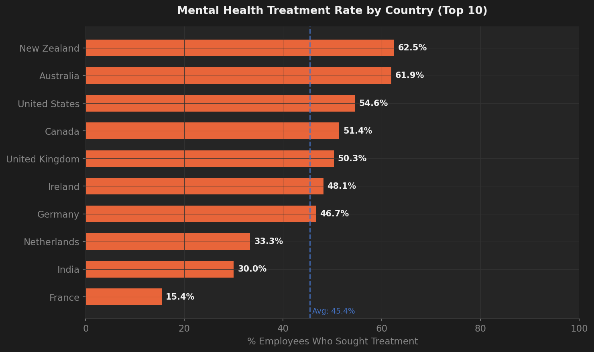
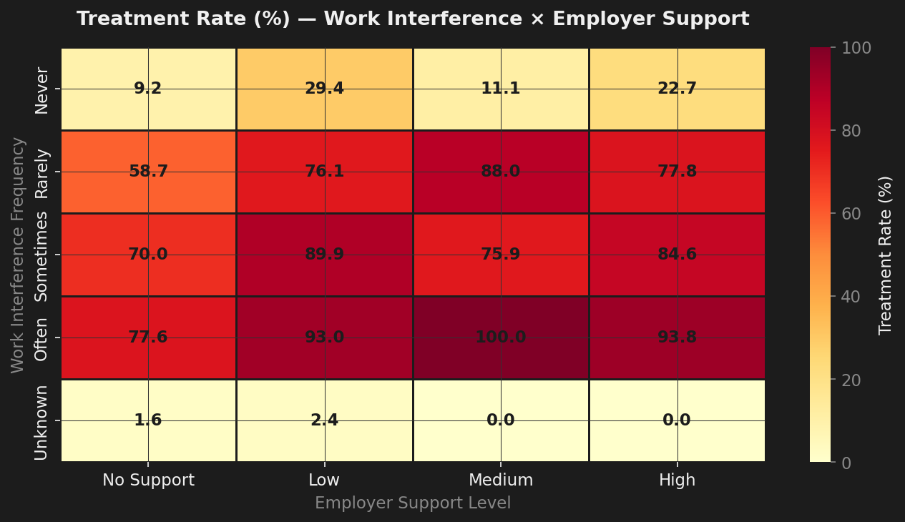
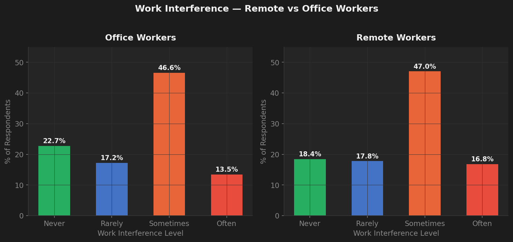
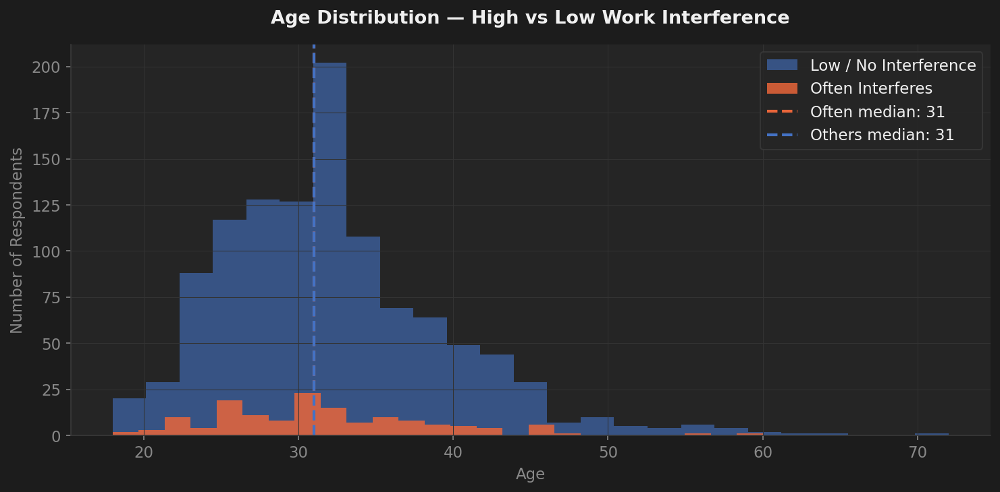
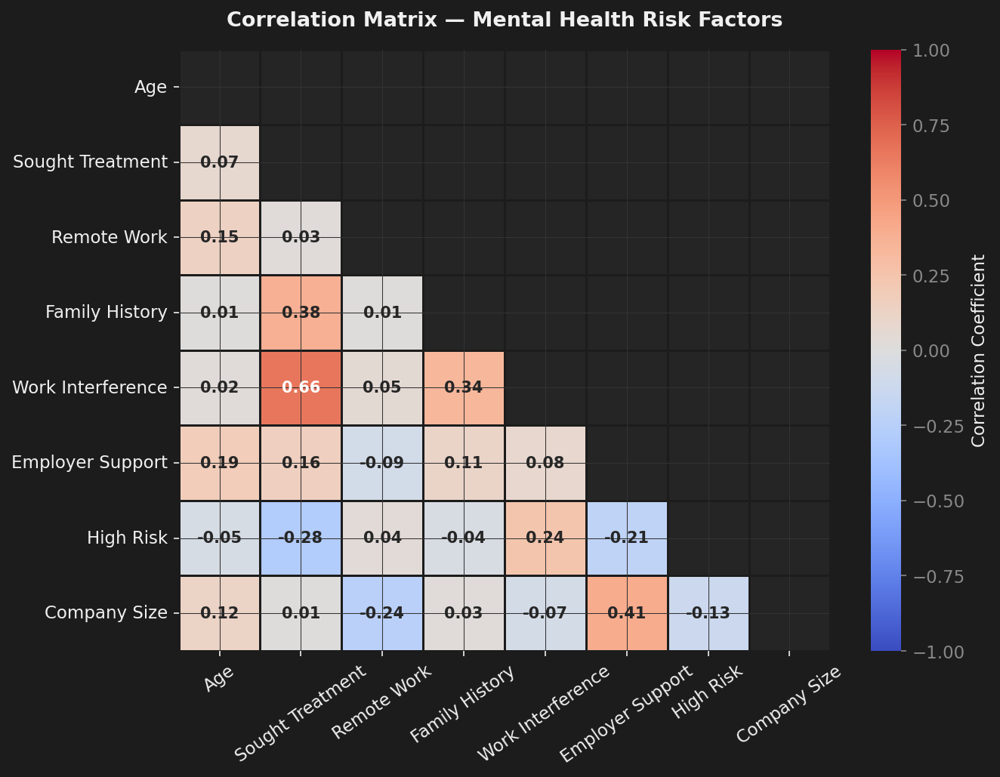
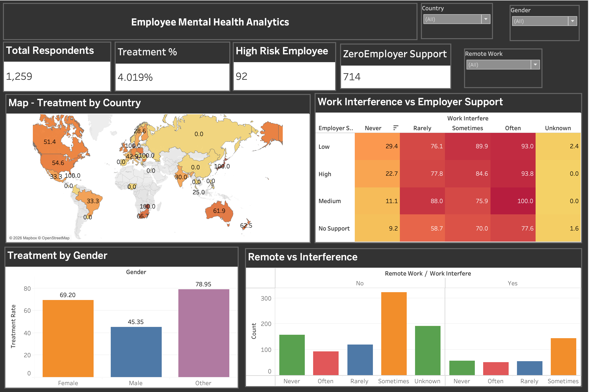

# Mental Health in the Workplace — Data Analytics

> **An end-to-end data analytics project** exploring mental health attitudes, treatment patterns, and employer support across the global tech workforce.

[](https://python.org)
[](https://pandas.pydata.org)
[](https://www.tableau.com)
[](https://jupyter.org)
[](LICENSE)

---

## Table of Contents

- [Overview](#overview)
- [Key Findings](#key-findings)
- [Visualizations](#visualizations)
- [Dataset](#dataset)
- [Data Pipeline](#data-pipeline)
- [Tech Stack](#tech-stack)
- [Project Structure](#project-structure)
- [Getting Started](#getting-started)
- [Feature Engineering](#feature-engineering)
- [Data Dictionary](#data-dictionary)
- [Tableau Dashboard](#tableau-dashboard)
- [Contributing](#contributing)
- [License](#license)
- [Acknowledgements](#acknowledgements)

---

## Overview

Mental health remains one of the most under-addressed issues in the modern workplace, particularly in the technology sector. This project analyzes survey data from **1,259 tech professionals across 48+ countries** to uncover patterns in:

- **Treatment-seeking behavior** — Who seeks help, and what drives that decision?
- **Work interference** — How does mental health impact daily productivity?
- **Employer support** — Do company-provided benefits (wellness programs, anonymity, care options) actually influence outcomes?
- **High-risk identification** — Which employees are most at risk and lack support?

The analysis pipeline spans **raw data ingestion → cleaning & feature engineering → exploratory analysis → interactive Tableau dashboard**, delivering actionable insights for HR leaders and workplace wellness advocates.

---

## Key Findings

| Insight | Detail |
|---------|--------|
| **Treatment Rate** | **50.4%** of respondents have sought mental health treatment |
| **Geographic Variation** | New Zealand (62.5%) and Australia (61.9%) lead in treatment rates; France trails at 15.4% |
| **Family History** | Strongest predictor of treatment-seeking (correlation: **0.38**) |
| **Work Interference** | Highest correlation with treatment (**0.66**) — those whose work is "Often" affected seek help at **93%+** rates |
| **Employer Support Gap** | Employees with **zero employer support** who report frequent interference are flagged **high-risk** |
| **Remote Work** | Minimal difference in work interference levels between remote and office workers |
| **Company Size** | Larger companies (500+) provide significantly more support (correlation: **0.41** between size and support) |

---

## Visualizations

### 1. Treatment Rate by Country (Top 10)
<p align="center">
  
</p>

> New Zealand and Australia lead with 60%+ treatment rates, while the global average sits at **45.4%**.

### 2. Work Interference × Employer Support Heatmap
<p align="center">
  
</p>

> Among employees where work interference is **"Often"** and employer provides **Medium** support, treatment rates reach **100%**.

### 3. Remote vs Office Workers — Work Interference
<p align="center">
  
</p>

> Remote work shows no meaningful reduction in work interference — both groups cluster around **47%** in the "Sometimes" category.

### 4. Age Distribution — High vs Low Interference
<p align="center">
  
</p>

> The median age for both groups is **31**, with interference evenly distributed across all age bands.

### 5. Correlation Matrix — Mental Health Risk Factors
<p align="center">
  
</p>

> Work interference (0.66) and family history (0.38) are the strongest predictors of treatment-seeking behavior.

---

## Dataset

| Property | Value |
|----------|-------|
| **Source** | [OSMI Mental Health in Tech Survey 2014](https://www.kaggle.com/datasets/osmi/mental-health-in-tech-survey) |
| **Records** | 1,259 respondents |
| **Original Features** | 27 columns |
| **Engineered Features** | 33 columns (after cleaning) |
| **Geographic Coverage** | 48+ countries (US: 60%, UK: 15%, Canada: 6%) |
| **File Format** | CSV |

### Raw Data Sample

| Age | Gender | Country | self_employed | family_history | treatment | work_interfere | no_employees |
|-----|--------|---------|---------------|----------------|-----------|----------------|--------------|
| 37 | Female | United States | NA | No | Yes | Often | 6-25 |
| 44 | M | United States | NA | No | No | Rarely | More than 1000 |
| 32 | Male | Canada | NA | No | No | Rarely | 6-25 |

---

## Data Pipeline

```
survey.csv (raw)
    │
    ├── 1. Drop useless columns (comments, Timestamp, state)
    ├── 2. Fix age outliers (clip to 18–75, impute median)
    ├── 3. Standardize gender (50+ variants → Male / Female / Other)
    ├── 4. Fill nulls (work_interfere → "Unknown", self_employed → "No")
    ├── 5. Create binary encodings (treatment, remote_work, family_history)
    ├── 6. Map work interference to ordinal scores (0–3)
    ├── 7. Compute employer support score (benefits + wellness + seek_help → 0–3)
    ├── 8. Flag high-risk employees (untreated + frequent interference + no support)
    ├── 9. Order company sizes (1-5 → 6, categorical → ordinal)
    └── 10. Rename columns to PascalCase for Tableau compatibility
              │
              ▼
    mental_health_clean.csv (33 features, 1,259 rows)
              │
              ▼
    Tableau Dashboard (.twbx) + Static Visualizations (PNG)
```

---

## Tech Stack

| Layer | Technology | Purpose |
|-------|------------|---------|
| **Language** | Python 3.10+ | Core scripting and analysis |
| **Data Wrangling** | Pandas 3.0, NumPy 2.4 | Cleaning, transformation, feature engineering |
| **Visualization** | Matplotlib 3.10, Seaborn 0.13 | Static EDA charts |
| **Interactive Dashboard** | Tableau Desktop | Interactive, filterable business dashboard |
| **Notebooks** | Jupyter Lab 4.5 | Exploratory analysis and documentation |
| **Reporting** | Excel (`.xlsx`) | MIS summary report |

---

## Project Structure

```
mental-health-workplace-analysis/
│
├── data/
│   ├── survey.csv                              # Raw survey data (27 cols, 1,259 rows)
│   └── mental_health_clean.csv                 # Cleaned + engineered data (33 cols)
│
├── notebooks/
│   ├── clean_mental_health.py                  # Standalone cleaning script
│   └── clean_mental_health.ipynb               # Jupyter notebook (EDA + cleaning)
│
├── visuals/
│   ├── chart1_treatment_by_country.png         # Bar chart — treatment rates by country
│   ├── chart2_interference_support_heatmap.png # Heatmap — interference × support
│   ├── chart3_remote_vs_interference.png       # Grouped bar — remote vs office
│   ├── chart4_age_distribution.png             # Histogram — age by interference level
│   └── chart5_correlation_matrix.png           # Triangular correlation matrix
│
├── tableau/
│   └── mental_health_dashboard.twbx            # Packaged Tableau workbook
│
├── reports/
│   └── MIS_Report.xlsx                         # Summary MIS report
│
├── venv/                                       # Python virtual environment
│
└── README.md                                   # ← You are here
```

---

## Getting Started

### Prerequisites

- **Python 3.10+**
- **Tableau Desktop** or [Tableau Reader](https://www.tableau.com/products/reader) (free) — for the interactive dashboard

### Installation

```bash
# 1. Clone the repository
git clone https://github.com/<your-username>/mental-health-workplace-analysis.git
cd mental-health-workplace-analysis

# 2. Create and activate virtual environment
python3 -m venv venv
source venv/bin/activate          # macOS / Linux
# venv\Scripts\activate           # Windows

# 3. Install dependencies
pip install pandas numpy matplotlib seaborn jupyter

# 4. Run the data cleaning pipeline
python notebooks/clean_mental_health.py

# 5. Launch Jupyter for interactive exploration
jupyter lab notebooks/clean_mental_health.ipynb
```

### Quick Verification

After running the cleaning script, you should see:

```
Shape: (1259, 33)
Null counts: 0 across all columns
Gender distribution: Male ~980, Female ~248, Other ~31
High risk employees: ~128
Treatment rate: 50.4%

Saved: mental_health_clean.csv
```

---

## Feature Engineering

The following features were **derived** during the data cleaning pipeline to enable deeper analysis:

| Feature | Type | Logic |
|---------|------|-------|
| `AgeBand` | Categorical | Binned age into `18-25`, `26-35`, `36-45`, `46+` |
| `treatment_binary` | Binary (0/1) | `1` if respondent sought treatment |
| `remote_work_binary` | Binary (0/1) | `1` if respondent works remotely |
| `family_history_binary` | Binary (0/1) | `1` if family history of mental illness |
| `work_interfere_score` | Ordinal (0–3) | `Never=0`, `Rarely=1`, `Sometimes=2`, `Often=3`, `Unknown=-1` |
| `employer_support_score` | Ordinal (0–3) | Sum of: benefits(Yes) + wellness_program(Yes) + seek_help(Yes) |
| `employer_support_label` | Categorical | Mapped score → `No Support` / `Low` / `Medium` / `High` |
| `high_risk` | Binary (0/1) | Untreated **AND** work interference ∈ {Often, Sometimes} **AND** zero employer support |
| `company_size_order` | Ordinal (1–6) | Maps company size categories to ordinal ranking |

---

## Data Dictionary

### Cleaned Dataset — `mental_health_clean.csv`

<details>
<summary><strong>Click to expand full data dictionary (33 columns)</strong></summary>

| # | Column | Type | Description |
|---|--------|------|-------------|
| 1 | `Age` | int | Respondent age (18–75, outliers imputed with median) |
| 2 | `Gender` | str | Standardized to `Male` / `Female` / `Other` |
| 3 | `Country` | str | Country of residence |
| 4 | `SelfEmployed` | str | Whether the respondent is self-employed (`Yes`/`No`) |
| 5 | `FamilyHistory` | str | Family history of mental illness (`Yes`/`No`) |
| 6 | `Treatment` | str | Has the respondent sought treatment (`Yes`/`No`) |
| 7 | `WorkInterfere` | str | How often mental health interferes with work (`Never`/`Rarely`/`Sometimes`/`Often`/`Unknown`) |
| 8 | `CompanySize` | str | Number of employees (`1-5` to `More than 1000`) |
| 9 | `RemoteWork` | str | Works remotely at least 50% of the time (`Yes`/`No`) |
| 10 | `TechCompany` | str | Is the employer a tech company (`Yes`/`No`) |
| 11 | `Benefits` | str | Does employer provide mental health benefits |
| 12 | `CareOptions` | str | Does respondent know about care options |
| 13 | `WellnessProgram` | str | Employer offers a wellness program |
| 14 | `SeekHelp` | str | Employer provides resources to seek help |
| 15 | `Anonymity` | str | Is anonymity protected if seeking help |
| 16 | `LeaveEase` | str | Ease of taking medical leave for mental health |
| 17 | `mental_health_consequence` | str | Would discussing mental health have negative consequences |
| 18 | `phys_health_consequence` | str | Would discussing physical health have negative consequences |
| 19 | `coworkers` | str | Willingness to discuss mental health with coworkers |
| 20 | `supervisor` | str | Willingness to discuss mental health with supervisor |
| 21 | `mental_health_interview` | str | Would bring up mental health in an interview |
| 22 | `phys_health_interview` | str | Would bring up physical health in an interview |
| 23 | `mental_vs_physical` | str | Does employer take mental health as seriously as physical |
| 24 | `ObservedConsequence` | str | Has observed negative consequences for coworkers |
| 25 | `AgeBand` | str | Age group: `18-25`, `26-35`, `36-45`, `46+` |
| 26 | `treatment_binary` | int | Binary encoding of Treatment |
| 27 | `remote_work_binary` | int | Binary encoding of RemoteWork |
| 28 | `family_history_binary` | int | Binary encoding of FamilyHistory |
| 29 | `work_interfere_score` | int | Ordinal score for work interference (0–3, -1=Unknown) |
| 30 | `employer_support_score` | int | Composite support score (0–3) |
| 31 | `employer_support_label` | str | Human-readable support level |
| 32 | `high_risk` | int | High-risk flag (1 = at risk) |
| 33 | `company_size_order` | int | Ordinal company size (1–6) |

</details>

---

## Tableau Dashboard

The interactive Tableau dashboard (`tableau/mental_health_dashboard.twbx`) provides filterable views for business stakeholders.

<p align="center">
  <!-- TODO: Add Tableau dashboard screenshot here -->
  
</p>

### How to Open

| Method | Requirement |
|--------|-------------|
| **Tableau Desktop** | Paid license (free for [students](https://www.tableau.com/academic/students)) |
| **Tableau Reader** | [Free download](https://www.tableau.com/products/reader) — read-only access |
| **Tableau Public** | Upload to [public.tableau.com](https://public.tableau.com) for browser access |

```bash
# Open directly from terminal (macOS, requires Tableau installed)
open tableau/mental_health_dashboard.twbx
```

---

## Contributing

Contributions are welcome! Here's how to get started:

1. **Fork** the repository
2. **Create** a feature branch (`git checkout -b feature/add-ml-model`)
3. **Commit** your changes (`git commit -m 'Add logistic regression model'`)
4. **Push** to the branch (`git push origin feature/add-ml-model`)
5. **Open** a Pull Request

### Ideas for Contribution

- Add ML classification models (Logistic Regression, Random Forest) to predict treatment-seeking
- Build additional Tableau worksheets (e.g., geographic chloropleth map)
- Add temporal analysis with multi-year OSMI data (2016, 2017, 2019)
- Statistical hypothesis testing (chi-squared, t-tests) for significance validation

---

## License

This project is licensed under the **MIT License** — see the [LICENSE](LICENSE) file for details.

---

## Acknowledgements

- **Data Source**: [Open Sourcing Mental Illness (OSMI)](https://osmihelp.org/) — Mental Health in Tech Survey 2014
- **Platform**: [Kaggle](https://www.kaggle.com/datasets/osmi/mental-health-in-tech-survey)
- **Tools**: Python, Pandas, Matplotlib, Seaborn, Tableau, Jupyter

---

<p align="center">
  <b>If you found this project useful, please star the repository!</b>
</p>
